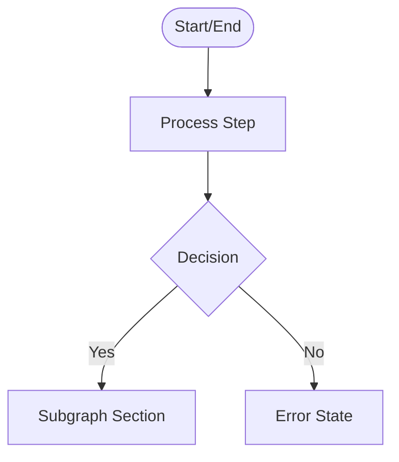

# Bridgelet User Flow Diagrams

This directory contains comprehensive user flow diagrams for the Bridgelet crypto onboarding platform. These diagrams represent the complete user journeys for both Senders and Recipients, including all error scenarios and decision points.

## Overview

Bridgelet is a crypto onboarding solution that enables users to send cryptocurrency to recipients who don't have wallets yet. The core concept is "send first, recipient claims later" - similar to a Venmo request but for crypto.

## Files

| File | Description |
|------|-------------|
| `sender-flow.mmd` | Complete sender journey from entry to success |
| `recipient-flow.mmd` | Complete recipient journey from claim link to funds received |
| `error-flows.mmd` | All error scenarios and recovery paths |

## Entry Points

### Sender Entry Points
1. **Homepage** (`bridgelet.io`) - Primary entry via "Send Funds" CTA
2. **Direct Link** - Direct access to create claim form
3. **Integrated Widget** - Embedded in partner applications

### Recipient Entry Points
1. **SMS Link** - Claim link sent via text message
2. **Email Link** - Claim link sent via email
3. **WhatsApp** - Claim link shared via messaging
4. **QR Code Scan** - Physical or digital QR code
5. **Direct URL** - Manual entry of claim URL

## Decision Points Legend

Decision points in the diagrams are represented as diamond shapes (`{Decision}`) with the following outcomes:

| Symbol | Meaning |
|--------|---------|
| Yes/No | Binary decision paths |
| Valid/Invalid | Validation results |
| Success/Error | Operation outcomes |
| Multiple options | Branched paths (e.g., wallet types) |

## System vs User Actions

### System Actions (Automated)
- Token generation and verification
- Blockchain transaction submission
- Address validation
- Status polling
- Error detection and display

### User Actions (Interactive)
- Form input and submission
- Wallet connection and signing
- Link sharing via preferred method
- Address entry and confirmation
- Retry/cancel decisions

## Mobile-First Assumptions

The diagrams assume a mobile-first design approach, as most recipients will access claim links via mobile devices:

- **Touch Targets**: Minimum 44x44px for all interactive elements
- **Layout**: Single column, minimal horizontal scrolling
- **Input**: Keyboard-friendly with appropriate input types
- **Performance**: Optimized for mobile networks
- **Browser Support**: iOS Safari and Chrome Android

## Diagram Notation

### Node Types

### Color Coding (in Mermaid syntax)
- **Start/End**: Rounded rectangles `([ ])`
- **Processes**: Rectangles `[ ]`
- **Decisions**: Diamonds `{ }`
- **Subgraphs**: Grouped sections with labels
- **Errors**: Connected to error handling paths

## Alignment with Roadmap

These flows represent the **MVP scope (Q1 2026)**:

### Implemented (Q1 MVP)
- Basic ephemeral account creation
- XLM and USDC support
- Time-based expiration (1 day to 90 days)
- Wallet-based authentication (Freighter, WalletConnect)
- Claim link generation and sharing
- Sweep execution for claims
- Sender dashboard for tracking

### Future Enhancements (Post-MVP)
The following are noted but NOT included in current flows:
- Multi-asset claims (one link, multiple tokens) - Q3 2026
- Scheduled claims (claimable after specific date) - Future
- Conditional claims (email verification required) - Future
- Recurring payments - Future
- Fiat off-ramp (claim to bank account) - Future
- WebSocket real-time updates (currently using polling) - Q2 2026

## Key User Flows

### Sender Journey Summary
1. Entry via homepage or direct link
2. Connect Stellar wallet (if not connected)
3. Fill claim form (amount, asset, recipient name, message, expiry)
4. Review and confirm payment
5. Sign blockchain transaction
6. Receive shareable claim link and QR code
7. Optional: Track status in dashboard

### Recipient Journey Summary
1. Receive and open claim link
2. System verifies claim token validity
3. View claim details (amount, sender, message, expiry)
4. Enter destination Stellar wallet address
5. Confirm claim details
6. Wait for sweep execution (5-10 seconds)
7. Receive confirmation with transaction details

### Error Handling Summary
All errors follow a consistent pattern:
1. **Detection**: System identifies error condition
2. **Display**: User-friendly error message (no technical jargon)
3. **Explanation**: Clear description of what happened
4. **Action**: Suggested next steps or recovery options
5. **Support**: Contact information when needed

## Security Considerations

- JWT tokens are single-use and time-bound
- Wallet addresses validated client-side and server-side
- No private keys stored or transmitted
- Rate limiting on all endpoints
- HTTPS only for all communications

## Testing Scenarios

Based on these flows, the following test scenarios should be covered:

### Sender Tests
- [ ] Complete happy path from entry to success
- [ ] Wallet connection failures and retries
- [ ] Form validation errors
- [ ] Transaction failures and recovery
- [ ] Dashboard operations (view, cancel, reclaim)

### Recipient Tests
- [ ] Valid claim link flow
- [ ] Invalid/expired token handling
- [ ] Already claimed scenario
- [ ] Invalid address validation
- [ ] Sweep failure and retry
- [ ] Mobile responsiveness

### Error Tests
- [ ] All token error states
- [ ] Wallet connection errors
- [ ] Network unavailability
- [ ] Rate limiting behavior
- [ ] Server error handling

## Viewing the Diagrams

These diagrams are written in [Mermaid](https://mermaid.js.org/) syntax and can be viewed:

1. **GitHub/GitLab**: Automatically rendered when viewing `.mmd` files
2. **VS Code**: Install Mermaid extension for live preview
3. **Mermaid Live Editor**: Copy content to [mermaid.live](https://mermaid.live)
4. **Documentation**: Export to PNG/SVG using Mermaid CLI

## Maintenance

When updating these diagrams:
1. Ensure changes align with roadmap priorities
2. Update this README if notation or structure changes
3. Verify all acceptance criteria are still met
4. Test diagram rendering after modifications

## Questions or Feedback

For questions about these flows:
- Technical implementation: See `/docs/FRONTEND_TECHNICAL_SPEC.md`
- UI/UX requirements: See `/docs/bridgelet-frd-ui-ux.md`
- Project timeline: See `/ROADMAP.md`

---

**Document Version**: 1.0  
**Last Updated**: March 2026  
**Status**: MVP Complete  
**Next Review**: After Q2 2026 enhancements
